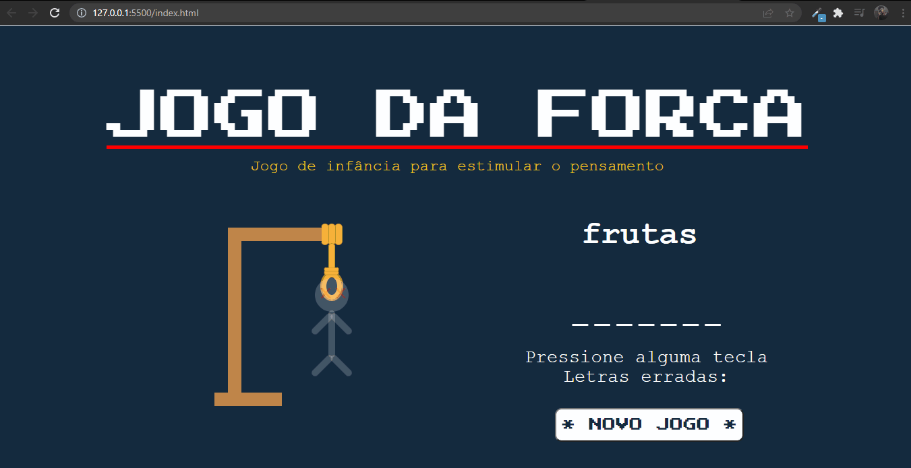

# Jogo da forca 🕹️

> Projeto Jogo da Forca focado em aprender conceitos/habilidades em javascript;
> Alguns conhecimentos aplicados nesse projeto:
Objetos, arrays e manipulação deles, estruturas de repetição e condicionais, querySelector, eventListener...

### Tecnologias usadas:
 
   
    

## 🤝 Colaboradores

<a href="https://www.linkedin.com/in/marcusviniciusbeghelisantos/" target="_blank">Marcus Vinícius</a> 

